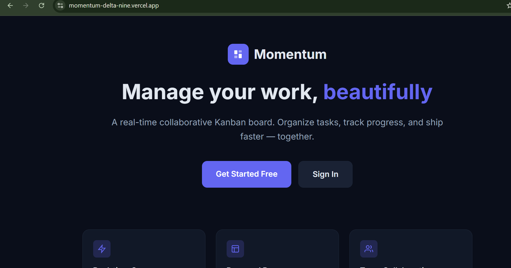
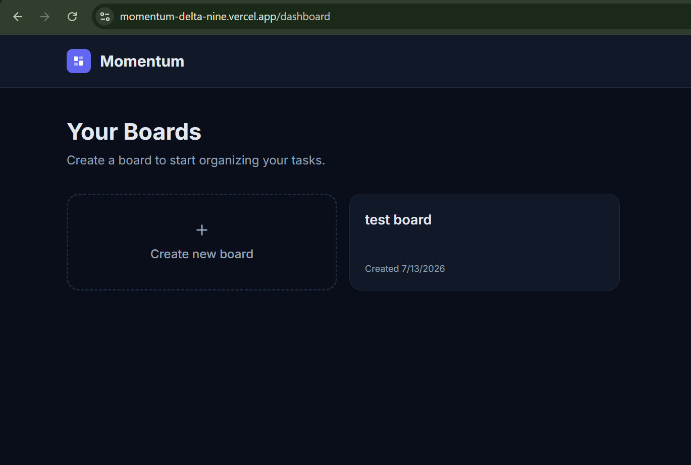
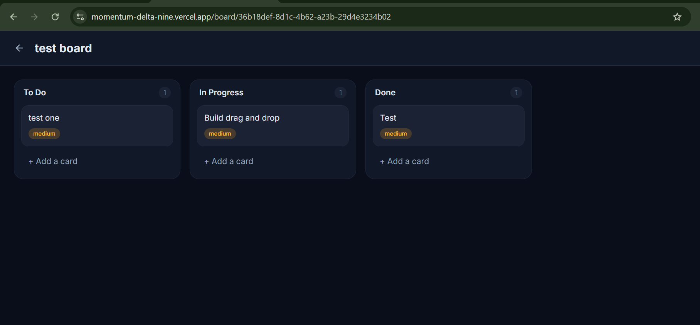

# 🚀 Momentum

### A real-time collaborative Kanban board

Organize tasks, track progress, and ship faster — together.

**[🌐 Live Demo](https://momentum-delta-nine.vercel.app)**

---

## ✨ Overview

Momentum is a full-stack, real-time collaborative Kanban board inspired by Trello and Notion. Users sign in with Google, create boards, organize tasks into columns, and drag cards between them — with every change syncing live across all connected users.

## 🎯 Features

- **🔐 Google OAuth Authentication** — Secure sign-in powered by Supabase Auth
- **📋 Board Management** — Create, view, and delete unlimited boards
- **🗂️ Kanban Columns** — Organize tasks across To Do, In Progress, and Done
- **🖱️ Drag & Drop** — Smooth card movement between and within columns (dnd-kit)
- **⚡ Real-Time Sync** — Changes appear instantly across all open windows via Supabase Realtime
- **📝 Rich Task Details** — Add descriptions, priority levels, and due dates
- **🔒 Row Level Security** — Database-level access control so users only see their own data
- **🌙 Dark Mode UI** — Clean, modern deep-blue theme

## 🖼️ Screenshots

### Kanban Board

### Task Details

## 🛠️ Tech Stack

| Layer | Technology |
|-------|-----------|
| **Framework** | Next.js 16 (App Router) |
| **Language** | TypeScript |
| **Styling** | Tailwind CSS |
| **Database** | Supabase (PostgreSQL) |
| **Authentication** | Supabase Auth (Google OAuth) |
| **Real-time** | Supabase Realtime |
| **Drag & Drop** | @dnd-kit |
| **Deployment** | Vercel |

## 🏗️ Architecture

\`\`\`
User Browser (React + dnd-kit)
        ↓  ↑ (live subscription)
Next.js App Router + Server Actions
        ↓
Supabase
  ├── PostgreSQL (data)
  ├── Auth (sessions, OAuth)
  ├── Realtime (broadcasts row changes)
  └── RLS policies (security layer)
        ↓
Vercel hosting
\`\`\`

## 🔐 Security Highlights

Momentum uses PostgreSQL **Row Level Security (RLS)** to enforce access control at the database level. A \`security definer\` helper function (\`is_board_member\`) prevents infinite recursion in membership checks, ensuring users can only ever read or modify data for boards they own or belong to — even if the frontend were bypassed.

## 🚀 Getting Started

\`\`\`bash
# Clone the repository
git clone https://github.com/azmainabir/momentum.git
cd momentum

# Install dependencies
npm install

# Set up environment variables (.env.local)
NEXT_PUBLIC_SUPABASE_URL=your_supabase_url
NEXT_PUBLIC_SUPABASE_ANON_KEY=your_anon_key
NEXT_PUBLIC_SITE_URL=http://localhost:3000

# Run the development server
npm run dev
\`\`\`

Open [http://localhost:3000](http://localhost:3000) to view it.

## 📄 License

This project is open source and available under the MIT License.

---

**Developed by Azmain Tahmid Abir**

